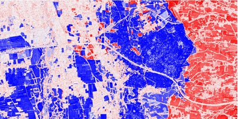
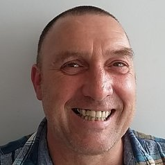
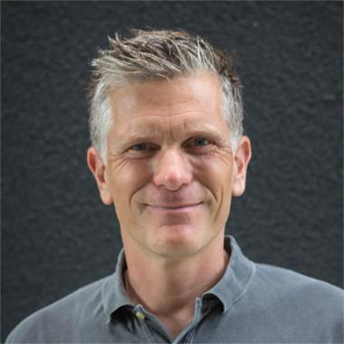

The [**LASTIG lab**](https://www.umr-lastig.fr/) is the French leading lab in **Geographic Information sciences**. The lab covers the complete lifecycle of geospatial data from their capture to their visualisation, including modelling, integration & analysis.

We propose every 2 or 3 months seminars that gather **guest keynotes** and presentations of **lab members/affiliates** on a topic at stake. Both mature and on-going works can be featured to stimulate discussions and introduce new lab projects.

Our seminars are **hybrid, free, open to everyone**, assuming you are preliminarly registered. In case of questions, feel free to reach us at dir-lastig_(at)_ign_(dot)_fr.

# January 16, 2025: _Monitoring a dynamic world_

Cover introduction

## 👑 Keynotes speakers

> [Lex Comber](https://environment.leeds.ac.uk/geography/staff/1020/professor-lex-comber), University of Leeds, United Kingdom
>
> **Title**.

> [Alexander Zipf](https://www.geog.uni-heidelberg.de/de/personen-am-institut/prof-dr-alexander-zipf), Universität Heidelberg, Germany
>
> **Title**.

## ⚙ Technical talks

*   _Seeing Urban Densification through the Buildings’ Lens: A User-Oriented and Collaborative Approach_. [Ana-Maria Raimond](https://www.umr-lastig.fr/Ana-Maria-Raimond-homepage/), MEIG team.
*   _LiDAR/Image geometric change detection_. [Teng Wu](https://whuwuteng.github.io/), ACTE team.
*   _Bi-temporal VHR image change detection with text_. [Yanis Benidir](https://yb23.github.io/), STRUDEL team.

## 🕤 Schedule
Questions & Answers will be possible after every talk. No worries.

| Time        | Speaker          | Slides |
|:-------------|:------------------|:------|
| 9:15           | Welcome by Bruno Vallet (head of LASTIG)| TBD  |
| 9:30           | Lex Comber (Univ of Leeds, UK) |TBD   |
| 10:10 | Ana-Maria Raimond (LASTIG)   | TBD   |
| 10:30   | Teng Wu (LASTIG)      | TBD    |
| 10:50 | Yanis Benidir (LASTIG) | TBD   |
| 11:10 | Alexander Zipf (Univ Heidelberg, Germany)   | TBD  |

* * *

### ☝ Registration
Registration is mandatory, free of charge and will be possible through the link provided below.
Deadline is **January 8, 2025**.
> [Link to the form](Not yet available).

Be sure we won't do anything with your email address but sending you information about our seminars.

### 🎯 How to join us ?

#### On-site
The seminar will take place in [ENSG-Géomatique](https://ensg.eu/fr), Champs-sur-Marne. It is 5-minute walk for Noisy-Champs station ([RER A](https://www.ratp.fr/plans-lignes/rer/a)). More details are available **[here](https://ensg.eu/en/node/62)**.

The exact location is **Picard** room:
 - Level -1 from the main stairs in the central hall;
 - Left door and just follow the signs. 

#### Remotely
A zoom link will be sent to your registered email a couple of days prior to the event, assuming you registered in due time.

* * *

