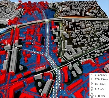
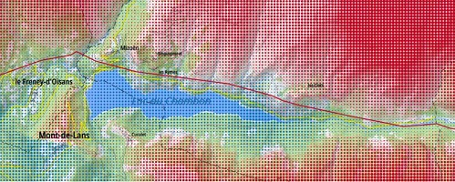

The [**LASTIG lab**](https://www.umr-lastig.fr/) is the French leading lab in **Geographic Information sciences**. The lab covers the complete lifecycle of geospatial data from their capture to their visualisation, including modelling, integration & analysis.

We propose every 2 or 3 months seminars that gather **guest keynotes** and presentations of **lab members/affiliates** on a topic at stake. Both mature and on-going works can be featured to stimulate discussions and introduce new lab projects.

Our seminars are **hybrid, free, open to everyone**, assuming you are preliminarly registered. In case of questions, feel free to reach us at dir-lastig_(at)_ign_(dot)_fr.

# September 12, 2025: _Uncertainty and risks_

The recent years have witnessed a tremedous **change of paradigm**, with a deluge of multi-modal geospatial data (images, text, in-situ measurements, model outputs, etc.). Each modality comes with its own noise level and uncertainty, which should be quantified for numerous application cases. 
This is all the more true for topics with **high stake** such as infrastructure monitoring, natural hazards or sustainable mobility.
This seminar targets to **address both subjects, sometimes interwinned**, in order to emphasize the numerous facets of uncertainty and the necessarity of tacking such topics for key environmental use cases.

## 👑 Keynote speaker

> [Andrei Bursuc](https://abursuc.github.io/), valeo.ai
>
> **Reliability in the Age of Foundation Models**.

## ⚙ Technical talks

*   _Visualiser des données entachées d'incertitude. Application au risque de submersion côtière_. [Jacques Gautier](https://www.umr-lastig.fr/jacques-gautier/), GEOVIS team.
*   _Propagation d'incertitudes pour la construction d'itinéraires résilients_. [Arnaud Le Guilcher](https://www.umr-lastig.fr/aleguilcher_homepage/), MEIG team.
*   _''Uncertainties and risks'' in the STRUDEL team : an overview of existing works_. [Alexandre Hipper-Ferrer](https://ahippert.github.io/), STRUDEL team.
*    _Suivi de déformation d'ouvrages d'art_. [Jean-Michael Muller](https://www.umr-lastig.fr/jmmuller_lastig_homepage/), ACTE team.

## 🕤 Schedule
Questions & Answers will be possible after every talk. No worries.

| Time        | Speaker          | Slides |
|:-------------|:------------------|:------|
| 9:15           | Welcome by Clément Mallet (head of LASTIG)|  |
| 9:30           | Andrei Bursuc (Valeo.ai) |   |
| 10:20 | Jacques Gautier (LASTIG)   | TBD  |
| 10:50   | Arnaud Le Guilcher (LASTIG)      | TBD   |
| 11:20 | Alexandre Hipper-Ferrer (LASTIG) | TBD  |
| 11:50 | Jean-Michael Muller (LASTIG)   | TBD  |

* * *

### ☝ Registration
Registration is mandatory, free of charge and can be done through this link.
Deadline is **September 8, 2025**.
> [Link to the form](https://forms.cloud.microsoft/Pages/ResponsePage.aspx?id=EP0g8syDRUiFYPEzSGxLGHWNCXfhXVBFqi4ThU2Xe5FUNDIySDRZQzA4M002OEU1MDlNRlA4MVRGUy4u).

Be sure we won't do anything with your email address but sending you information about our seminars.

### 🎯 How to join us ?

#### On-site
The seminar will take place in [ENSG-Géomatique](https://ensg.eu/fr), Champs-sur-Marne. It is 5-minute walk for Noisy-Champs station ([RER A](https://www.ratp.fr/plans-lignes/rer/a)). More details are available **[here](https://ensg.eu/en/node/62)**.

The exact location is **Picard** room:
 - Level -1 from the main stairs in the central hall;
 - Left door and just follow the signs. 

#### Remotely
A zoom link will be sent to your registered email a couple of days prior to the event, assuming you registered in due time.

* * *

