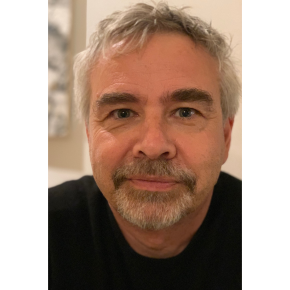

The [**LASTIG lab**](https://www.umr-lastig.fr/) is the French leading lab in **Geographic Information sciences**. The lab covers the complete lifecycle of geospatial data from their capture to their visualisation, including modelling, integration & analysis.

We propose every 2 or 3 months seminars that gather **guest keynotes** and presentations of **lab members/affiliates** on a topic at stake. Both mature and on-going works can be featured to stimulate discussions and introduce new lab projects.

Our seminars are **hybrid, free, open to everyone**, assuming you are preliminarly registered. In case of questions, feel free to reach us at dir-lastig_(at)_ign_(dot)_fr.

# September 2026: _Intervisibility_

   

_Rationale_  
The LASTIG has been working on this field for a long time among its four research teams. In order to break the existing silos between communities and show the current state of the art, this seminar gathers international experts of the field and current developments in our lab.  

## 👑 Keynote speaker

> [Vincent Lepetit](https://vincentlepetit.github.io/), Ecole des Ponts ParisTech, France
>
> **Title coming soon**.

## ⚙ Technical talks

*  _Coming soon_. [Pierre Aumond (UMRAE)](https://pagespro.univ-gustave-eiffel.fr/pierre-aumond), for STRUDEL team.
*   _Assessing the sensibility of intervisibility on the quality of 3D geometry_. [Bruno Vallet](https://www.umr-lastig.fr/bruno-vallet/), ACTE team.
*   _Coming soon_. [Laurence Jolivet](https://www.umr-lastig.fr/members/Laurence-Jolivet/) and [Cécile Duchêne]([https://whuwuteng.github.io/](https://www.umr-lastig.fr/members/C%C3%A9cile-Duch%C3%AAne/)), MEIG team.
*   _What Can Be Seen: Raster Occlusion and Geometric Visibility_. [Maxim Spur](https://www.umr-lastig.fr/members/Maxim-Spur/) and [Gérald Choqueux](https://www.umr-lastig.fr/members/G%C3%A9rald-Choqueux/), GEOVIS team.

## 🕤 Schedule
Questions & Answers will be possible after every talk. No worries.

| Time        | Speaker          | Slides |
|:-------------|:------------------|:------|
| 9:15  |Bruno Vallet| --   |
| 9:30  | Vincent Lepetit | --   | 
| 10:30  |Pierre Aumond  |--   |
| 11:00 | Bruno Vallet   | --   |
| 11:20 | Laurence Jolivet & Cécile Duchêne  | --     |
| 11:40 |Maxim Spur & Gérald Choqueux | --   |

* * *

### ☝ Registration
Registration is mandatory, free of charge and will be possible through the link provided below.
Deadline is **September 12, 2025**.
> [Link to the form](https://forms.office.com/e/DWkysXvvfx?origin=lprLink).

Be sure we won't do anything with your email address but sending you information about our seminars.

### 🎯 How to join us ?

#### On-site
The seminar will take place in [Géodata Paris (ex.ENSG-Géomatique)](https://ensg.eu/fr), Champs-sur-Marne. It is 5-minute walk for Noisy-Champs station ([RER A](https://www.ratp.fr/plans-lignes/rer/a)). More details are available **[here](https://ensg.eu/en/node/62)**.

The exact location is **Picard** room:
 - Level -1 from the main stairs in the central hall;
 - Left door and just follow the signs. 

#### <u>Remotely</u>
A zoom link will be sent to your registered email a couple of days prior to the event, assuming you registered in due time.

* * *

