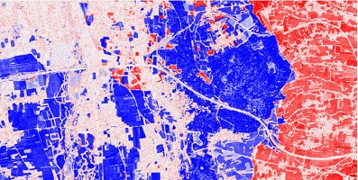
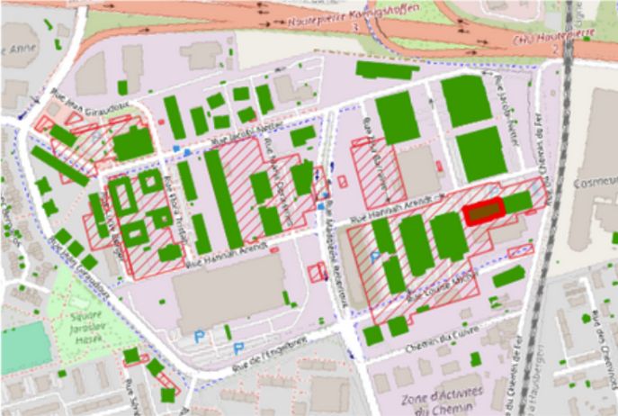
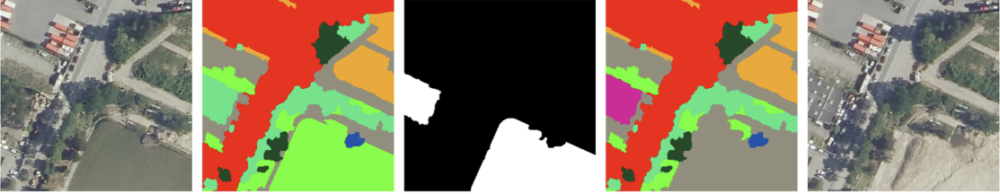
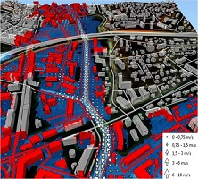
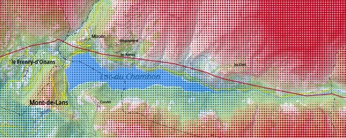
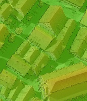

## LASTIG seminars (past)

All information about past LASTIG seminars is provided here.

### January 16, 2026: _Monitoring a dynamic world_

   

| Time      | Speaker         | Title | Slides |
|:-------------|:------------------|:------|:------|
| 9:15  | Bruno Vallet|Welcome| [pdf](documents/SemThematique_LASTIG_Vallet_16012026.pdf)   |
| 9:15  | Nicolas Gonthier (IGN)|IGN Road map on change detection | [pdf](documents/SemThematique_Gonthier16012026.pdf)   | 
| 9:30  | Alexis Comber (University of Leeds, UK)  |Detecting neighbourhood dynamics|[html](documents/SemThematique_Comber_16012026.html)   |
| 10:10 | Ana-Maria Raimond (LASTIG)   |Seeing Urban Densification through the Buildings’ Lens: A User-Oriented and Collaborative Approach| [pdf](documents/SemThematique_Raimond16012026.pdf)   |
| 10:30 | Teng Wu (LASTIG)      |Image LiDAR based change detection and 
updating for urban 3D reconstruction| [pdf](documents/SemThematique_LASTIG_Wu_16012026.pdf)     |
| 10:50 | Yanis Benidir (LASTIG) |RethinkingChange
DetectionwithLLMs| [pdf](documents/SemThematique_Bendir16012026.pdf)   |
| 11:10 | Alexander Zipf (Univ Heidelberg, Germany)   |Monitoring dynamics
of OpenStreetMap| [pdf](documents/SemThematique_Zipf16012026.pdf)  |

### September 12, 2025: _Uncertainty and risks_

  

| Time        | Speaker         | Title | Slides |
|:-------------|:------------------|:------|:------|
| 9:15           | Clément Mallet (LASTIG)|Welcome|[pdf](documents/SemThematique_LASTIG_Mallet_12092025.pdf)  |
| 9:30           | Andrei Bursuc (Valeo.ai) | Reliability in the age of 
Foundation Models|[pdf](documents/SemThematique_LASTIG_Bursuc_12092025.pdf)   |
| 10:20 | Jacques Gautier (LASTIG)   |Visualiser des données entachées 
d’incertitude |[pdf](documents/SemThematique_LASTIG_Gautier_12092025.pdf)  |
| 10:50   | Arnaud Le Guilcher (LASTIG)      |Management of uncertainties 
for the computation of resilient 
trips |[pdf](documents/SemThematique_LASTIG_LeGuilcher_12092025.pdf)   |
| 11:20 | Alexandre Hipper-Ferrer (LASTIG) |Uncertainties and risks in the STRUDEL team : an overview of
existing works |[pdf](documents/SemThematique_LASTIG_HippertFerrer_12092025.pdf)  |
| 11:50 | Jean-Michael Muller (LASTIG)   | |--  |

### May 28, 2024: _All about NeRF_

| Time      | Speaker         | Title | Slides |
|:-------------|:------------------|:------|:------|
| 10:30           | Arnaud Le Guilcher & Bruno Vallet (LASTIG) | LASTIG presentation and introduction of LASTIG seminars  | --|
| 11:00 | Camille Billouard (CNES/LASTIG)   | NeRF et SDF (Signed Distance Field): introduction et applications aux images satellites multi-dates pour la reconstruction 3D  | [pdf](documents/SemThematique_Billouard_28052024.pdf) |
| 11:30 | Karim Kassab (CRITEO/LASTIG)   | Exploring 3D-aware Latent Spaces for Efficiently Learning Numerous Scenes | [pdf](documents/SemThematique_Kassab_28052024.pdf)  |
| 12:00   | Lulin Zhang (IPGP/LASTIG)      | Physics-based NeRF for Optical Satellite Images | --   |

[back](./)
